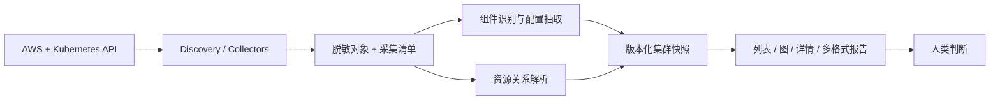

# EKS 信息采集、组件档案与关联拓扑：第一阶段方案

本文件取代原可行方案的第一阶段范围。目标：尽量完整地采集 EKS 和 Kubernetes 可见信息，特别是平台扩展组件的安装、配置、状态和使用情况，组织为人类可审查的集群档案与工作负载拓扑。能力是否可用、迁移是否适合由人判断。本文为设计，尚未实现或实测。

## 1. 首版交付边界

- Go，AWS SDK v2 + client-go；优先集群外、只读、run once。
- 输出 terminal summary、TUI、JSON、YAML、Markdown、离线 HTML；mini server 提供同一份快照的交互浏览。
- 重点交付资源目录、平台组件档案、配置摘要、工作负载关联图、证据与覆盖率。
- 自动能力判定、源侧需求提取、迁移 gap、评分、主动测试后移。长期采集和集群内部署保持后续路线。
- 允许自动识别组件、抽取配置和建立关系；这些整理结果须可溯源，不输出未经验证的能力结论。

“非默认”不作为采集过滤条件：默认组件的自定义参数可能很关键。所有可见平台组件都纳入，包括 AWS 托管、集群内自管和 Auto Mode 提供的组件。安装来源无法证明时标 unknown，不凭 namespace 或命名断言。

## 2. 完整采集与深度整理分两层

**通用发现层**：发现 API groups/resources、CRD/APIService、标准资源与扩展资源目录。记录每种资源是否可读、数量、范围、分页完成情况；不只依赖 kubectl get all。未知 CRD 也要出现，不能因为没有适配器而消失。

**组件适配层**：针对已知实现识别组件、解析其关键配置、关联安装实例和使用对象。初版优先 VPC CNI、EBS/EFS CSI、CoreDNS、kube-proxy、AWS Load Balancer Controller、Gateway API、Pod Identity、Karpenter；其他实现仍能通用浏览，再按真实集群样本补充适配器。

每种资源记录采集深度：metadata-only、selected-fields、sanitized-object，以及排除字段和原因。未知自定义资源默认至少发现目录/元数据；完整 spec/status 采集按资源 profile 开启，不能将可能含凭据的任意 CR 全量导出。广度覆盖与语义解析覆盖分别展示。

## 3. 采集与整理清单

| 领域 | 收集内容 | 人类看到的整理结果 |
|---|---|---|
| EKS | 版本/platform、endpoint、VPC/subnets/SG、日志/加密、身份配置、compute 模式、托管 add-on | 集群基础档案；AWS 与 K8s 信息交叉链接 |
| Compute/AMI | Node、node group、EC2/launch template、Karpenter NodePool/NodeClaim/NodeClass、Fargate profile；OS/架构/kernel/kubelet/runtime、labels/taints、capacity/allocatable | 按节点池、AZ、AMI、版本分组；期望配置与实际节点分别展示 |
| Add-ons/operators | AWS add-on 版本/configurationValues/health、controller workload/image/args/config、ServiceAccount、CRD、webhook、APIService | 每个安装实例的版本、来源、配置、状态、覆盖节点与相关资源 |
| CNI | 实现和镜像、DaemonSet/配置来源；VPC CNI 的 prefix delegation、custom networking、warm IP/ENI/prefix、SNAT、NetworkPolicy 配置；ENIConfig、SecurityGroupPolicy；相关节点/子网信息 | 按实现和节点池展示网络配置；明确哪些开关显式设置、哪些未观测到 |
| CSI | controller/node plugin 和 sidecars 版本、CSIDriver、CSINode、SC、PV/PVC、VolumeAttachment、CSIStorageCapacity；发现到的 snapshot API/对象；引用的 EBS/EFS 元数据 | driver → class → volume/claim → workload；SC 参数与已有卷 accessModes/volumeMode 分开展示 |
| CRI/runtime | Node runtimeVersion、OS/kernel/kubelet、RuntimeClass handler/overhead/scheduling、Pod runtimeClassName、容器 imageID/runtime ID | 节点运行时分布、RuntimeClass 声明及使用者；节点本地配置缺口 |
| L7/服务 | Service、EndpointSlice、Ingress/Class、Gateway/Class、Routes/ReferenceGrant、controller 配置、AWS LB 关联信息 | 入口到服务/端点/工作负载的声明关系、对象 status 和未解析引用 |
| 工作负载/镜像 | 控制器与 Pod 模板、init/ephemeral containers、镜像/tag/digest、资源配置、调度、安全上下文、探针、volumes | 缩容至零的 workload 仍可见；按镜像汇总使用者，模板镜像与运行镜像分开 |
| 身份/策略 | Access Entries/Policies、aws-auth、RBAC、IRSA/Pod Identity、相关 IAM role；Quota/LimitRange/PSA/admission/NetworkPolicy | 身份引用和绑定关系；策略配置及其 selector 匹配范围，不宣称完整有效权限 |
| 其他平台扩展 | DNS、metrics API、HPA/VPA/autoscaler、device plugin、observability、service mesh 等可见对象 | 统一组件目录；已识别与未识别扩展清单 |
| 状态证据 | ready/conditions/observedGeneration、近期 Events、采集时刻与 AWS health | 原系统报告的状态和时间；不新增健康评分 |

CNI 配置以实现版本为准。VPC CNI 官方仓库说明了多个环境变量及行为，应由版本化适配器整理：[VPC CNI](https://github.com/aws/amazon-vpc-cni-k8s)。CSI 的声明来自多个对象，CSIDriver 也不是完整 access mode 能力目录：[CSIDriver](https://kubernetes-csi.github.io/docs/csi-driver-object.html)。

对 AWS 资源采用关联扩展：从集群/节点/volume/LB/role 引用出发查询，避免无边界地扫描整个账号。记录无法访问、无法关联或存在多个候选的情况。ConfigMap、env 和 args 中与组件功能有关的非敏感配置是重要证据，应通过适配器提取，而不是一律丢弃。

## 4. 组件档案的组织方式

每个 ComponentInstance 包含：

- identity/category/provider；安装来源及识别证据。
- AWS 声明版本、期望镜像、实际运行 imageID；不能把 image tag 一律当作已证实的软件版本。
- 显式配置、配置来源、关联配置对象；冲突值并列呈现。
- 原系统报告的状态、控制器副本、node plugin 调度与 ready 分布。
- 相关 Class/CRD/CR/ServiceAccount/IAM role，以及实际使用的工作负载。
- 未获取的数据与原因；相关实现文档链接及版本。

示例存储详情呈现：SC provisioner/parameters/bindingMode/allowVolumeExpansion/allowedTopologies → CSIDriver/CSINode → controller/node plugin → PVC/PV 声明的 accessModes/volumeMode/status → 引用 workload。可汇总“观察到 12 个 RWO PVC”，但不由此生成“只支持 RWO”的结论。

示例网络详情呈现：VPC CNI 镜像、显式配置的 ENABLE_PREFIX_DELEGATION、WARM_PREFIX_TARGET、ENIConfig、相关节点和 Events。没有读到某配置时显示“未观测到显式值”；若附版本文档默认值，单独标为参考值，不能伪装成实际生效值。

## 5. 工作负载关联拓扑

默认聚焦一个 workload，并支持正向与反向关联。可按 namespace 或 app label 聚合，但 app label 分组标为启发式，不能把所有相似标签当成 ownership。

| 关系 | 依据与含义 |
|---|---|
| Deployment → ReplicaSet → Pod；CronJob → Job → Pod | ownerReferences，保留中间对象 |
| Pod → Node → EC2 → AMI/node group | nodeName/providerID/AWS 引用；不适用时保留边界 |
| Service → EndpointSlice → Pod | slice 关联与 endpoint targetRef；外部或未知端点也保留 |
| Service → 匹配 Pod | selector 匹配，和实际 EndpointSlice 后端分开 |
| Ingress/Route → Service；Route → Gateway → Class | spec 引用，附 status；命名端口、跨 namespace 引用须解析 |
| Workload/Pod → PVC → PV；PVC/PV → StorageClass → driver | claim/ref/provisioner；未绑定 PVC 与 StatefulSet volumeClaimTemplates 不能丢失 |
| Pod/template → ConfigMap/Secret 引用 | env/envFrom/volume/imagePullSecrets 等引用；保留引用，不读取 Secret 值 |
| Workload → ServiceAccount → IAM role | SA 引用、IRSA annotation 或 Pod Identity association；表示配置关联 |
| HPA → workload；PDB/NetworkPolicy → selector 匹配对象 | scaleTargetRef/selector；策略匹配不等于网络访问已验证 |
| CustomResource → 受控对象 | ownerReferences 或适配器；只有同名不能认定关联 |

每条边记录类型、来源字段、解析方式与 unresolved 状态。不生成虚构的应用间流量边。未知引用保留占位对象和“未采集/不存在/权限不足/无法确认”的区别。

UI 采用“资源列表＋可聚焦关系图＋右侧详情”，提供 compute/storage/routing/identity/configuration 过滤和反向引用。可借鉴 Headlamp 的资源详情与导航思路，同时服务于离线快照。图和表格共用选择状态；从任意整理字段能进入脱敏对象证据。

## 6. CRI 和节点本地信息的边界

CRI 是 kubelet 与容器运行时之间的接口，不能从 Kubernetes API 读取全部运行时内部状态。API 可见的 runtimeVersion、RuntimeClass 和 Pod 配置仍值得首版完整整理。containerd 配置、实际 runtime handlers、snapshotter、registry mirror、CNI 本地配置等节点细节可能需要节点级额外采集。RuntimeClass 存在不证明每个节点实际配置了对应 handler。[CRI](https://kubernetes.io/docs/concepts/containers/cri/)、[RuntimeClass](https://kubernetes.io/docs/concepts/containers/runtime-class/)。

首版把这些项列为“节点本地信息未采集”，并预留导入接口，未来可接入用户已有节点诊断包或独立采集器。不要把部署位置在集群内等同于可以读取节点所有信息。

## 7. 数据与模块架构

核心实体：Snapshot、Resource、ComponentInstance、ConfigurationFact、Relation、Evidence、Coverage。暂不要求 Capability/Requirement/Finding 引擎。模块采用编译期 Go 注册：Collector、ComponentAdapter、RelationResolver、Renderer；provider 细节保留在适配器中。

快照包含整理视图及支持它的脱敏证据，避免只保存易丢信息的摘要。JSON/YAML 保留结构；Markdown 展示摘要及附录；HTML/Web 支持逐层展开；较大快照使用目录包。所有输出来自同一数据模型。

## 8. 完整性的验收标准

不承诺不可实现的“所有信息 100% 可见”。承诺采集范围内的数据尽可能完整、遗漏可追踪：

1. 每个发现的资源类型均有覆盖记录：complete、partial、denied、unavailable、skipped；记录采集深度、对象数、页数、截断和时间。
2. 每个关键组件的安装信息、配置、状态、节点分布、使用者能够关联，未知组件不隐藏。
3. 每条整理信息可追溯到对象/字段；识别推断与原始字段明确区分。
4. 工作负载包含零副本、无 Pod、Pending、未绑定卷、失效引用等场景。
5. 不将未配置解释为关闭，不将未看到解释为不存在，不将就绪状态解释为完整业务能力。
6. 数据时间窗口、Events 保留范围、节点本地盲区和权限缺口在报告首页可见。
7. 在无 AWS/K8s 访问权限的机器上仍能离线浏览同一快照的资源、配置和关联。

首个开发切片调整为：**扫描 EKS + Kubernetes → 生成组件目录 → 展开 CNI/CSI 配置与节点分布 → 从 workload 追踪入口、存储、身份、镜像和节点 → 导出可离线浏览的报告。** 首版验收重点是覆盖与整理质量，不是自动判定规则数量。后续再用真实集群样本确定适配器优先级和排期。
